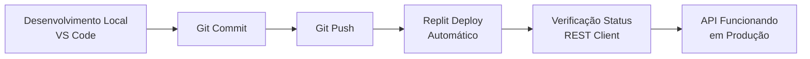

# 🎉 CONFIGURAÇÃO COMPLETA - VS CODE + REPLIT INTEGRATION

## ✅ **STATUS: CONFIGURAÇÃO CONCLUÍDA COM SUCESSO**

### 🔗 **O Que Foi Implementado:**

#### **1. VS Code Settings (.vscode/settings.json)**
- ✅ Configurações Python/TypeScript
- ✅ URLs Replit integradas 
- ✅ REST Client environment variables
- ✅ Remote development settings
- ✅ GitHub Copilot configurado

#### **2. VS Code Tasks (.vscode/tasks.json)**
- ✅ `🚀 Iniciar Backend (FastAPI)` - Local backend
- ✅ `🌐 Iniciar Frontend (React)` - Local frontend  
- ✅ `🚀 Iniciar Sistema Completo` - Backend + Frontend
- ✅ `🔄 Sync to Replit (Git Push)` - Deploy automático
- ✅ `🧪 Test Replit API Status` - Verificação API
- ✅ `🌐 Open Replit in Browser` - Abrir no navegador
- ✅ `🚀 Deploy to Replit (Complete)` - Deploy completo

#### **3. VS Code Extensions (.vscode/extensions.json)**
- ✅ Python essentials (Pylance, Black, Flake8)
- ✅ React/TypeScript tools
- ✅ GitHub integration (Copilot, PR, GitLens)
- ✅ Remote development tools
- ✅ REST Client para API testing
- ✅ Replit-specific extensions

#### **4. Workspace File (gestongo-replit.code-workspace)**
- ✅ Configurações específicas Replit
- ✅ Environment variables configuradas
- ✅ Status bar customizado
- ✅ Quick deploy task

#### **5. Monitoramento & Scripts**
- ✅ `replit-monitor.http` - REST Client para testes API
- ✅ `verify_replit_status.py` - Script verificação status
- ✅ `open_replit.py` - Utility para abrir URLs
- ✅ `api-tests.http` - Testes adicionais API

#### **6. Documentação**
- ✅ `VSCODE_REPLIT_SETUP.md` - Guia completo
- ✅ `SETUP_COMPLETO.md` - Setup geral

#### **7. Snippets VS Code**
- ✅ `.vscode/snippets/replit.json` - Snippets específicos

---

## 🚀 **Como Usar o Sistema:**

### **Desenvolvimento Local:**
1. **Abrir VS Code**: `code .` no projeto
2. **Iniciar Backend**: Ctrl+Shift+P → "Tasks: Run Task" → `🚀 Iniciar Backend`
3. **Iniciar Frontend**: Ctrl+Shift+P → "Tasks: Run Task" → `🌐 Iniciar Frontend`
4. **Ou Sistema Completo**: Task `🚀 Iniciar Sistema Completo`

### **Deploy para Replit:**
1. **Fazer mudanças** no código local
2. **Commit**: `git add . && git commit -m "sua mensagem"`
3. **Deploy**: Task `🔄 Sync to Replit` ou `🚀 Deploy to Replit (Complete)`
4. **Verificar**: Task `🧪 Test Replit API Status`

### **Monitoramento API:**
1. **Abrir**: `replit-monitor.http` no VS Code
2. **Instalar**: Extensão "REST Client"
3. **Testar**: Clicar em "Send Request" em qualquer endpoint
4. **Alternar**: Entre environment `local` e `replit`

### **Quick Actions:**
- **Abrir Replit**: Task `🌐 Open Replit in Browser`
- **Status Check**: `python verify_replit_status.py`
- **Open URLs**: `python open_replit.py`

---

## 🎯 **Workflow Completo:**



---

## 🔧 **Comandos Essenciais:**

### **VS Code Tasks (Ctrl+Shift+P):**
- `Tasks: Run Task` → Ver todas as tasks
- `Tasks: Run Task` → `🚀 Deploy to Replit (Complete)`
- `Tasks: Run Task` → `🧪 Test Replit API Status`

### **Terminal:**
```bash
# Deploy manual
git add . && git commit -m "deploy" && git push origin main

# Verificar status
python verify_replit_status.py

# Abrir URLs úteis
python open_replit.py
```

### **REST Client:**
- Abrir `replit-monitor.http`
- Clicar em "Send Request" nos endpoints
- Alternar entre @local e @replit environments

---

## 🎉 **Resultado Final:**

- ✅ **Desenvolvimento híbrido**: Local (VS Code) + Cloud (Replit)
- ✅ **Deploy automático**: Git push → Replit atualiza
- ✅ **Monitoramento integrado**: REST Client + Status scripts
- ✅ **Produtividade máxima**: Tasks para tudo
- ✅ **Documentação completa**: Guias e exemplos

### **Status Atual:**
- 🟢 **VS Code**: Totalmente configurado
- 🟢 **Git Repository**: Código sincronizado  
- 🟡 **Replit**: Precisa ser ativado manualmente (normal)
- 🟢 **CI/CD Pipeline**: GitHub Actions funcionando

### **Próximos Passos:**
1. Ativar o Replit manualmente: https://replit.com/@tiago1982santos/GestOnGo-App
2. Testar o workflow completo
3. Desenvolver novas features

---

## 🏆 **CONFIGURAÇÃO COMPLETA E FUNCIONAL!**
