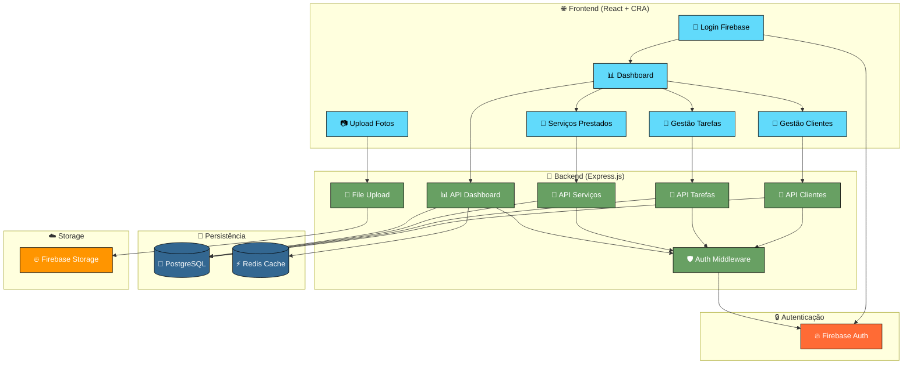
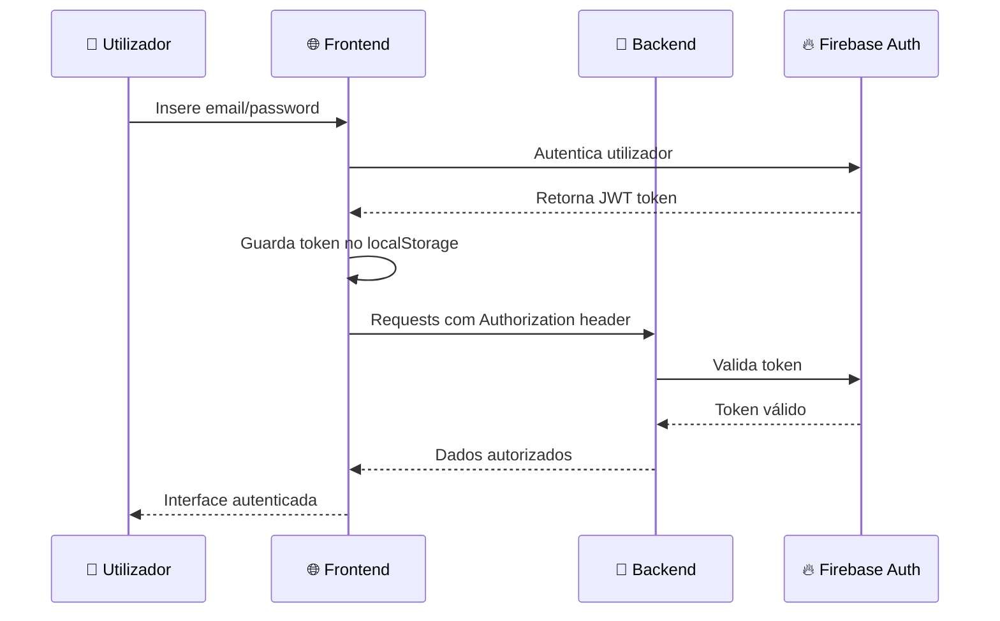
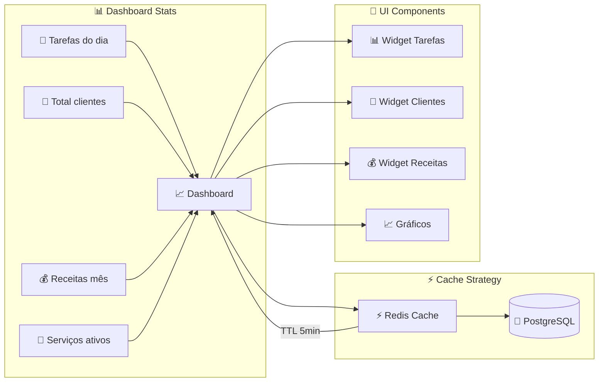
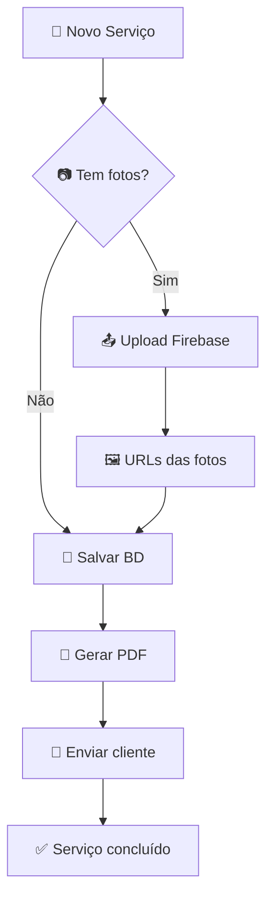
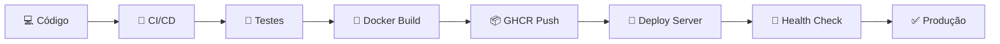

# 🎯 Fluxo da App GestOnGo

## 🔄 Arquitetura Geral

## 🔄 Fluxo de Autenticação

## 📊 Fluxo de Dados Dashboard

## 🔧 Fluxo de Serviços

## 🚀 Deployment Flow

---

## 📋 Notas Técnicas

### **Stack Principal:**
- **Frontend:** React 18 + CRA + Firebase SDK
- **Backend:** Node.js + Express.js + Firebase Admin
- **Database:** PostgreSQL (produção) + Redis (cache)
- **Storage:** Firebase Storage (fotos/documentos)
- **Deploy:** Docker + GitHub Actions + GHCR

### **Padrões Arquiteturais:**
- **API REST** com verbos HTTP semânticos
- **JWT Authentication** via Firebase
- **Cache Strategy** com Redis para dashboard
- **File Upload** com validação e compressão
- **Error Handling** centralizado e logging estruturado

### **Segurança:**
- ✅ **HTTPS** obrigatório em produção
- ✅ **Rate Limiting** nos endpoints sensíveis  
- ✅ **Input Validation** em todas as APIs
- ✅ **CORS** configurado adequadamente
- ✅ **JWT Verification** em rotas protegidas
